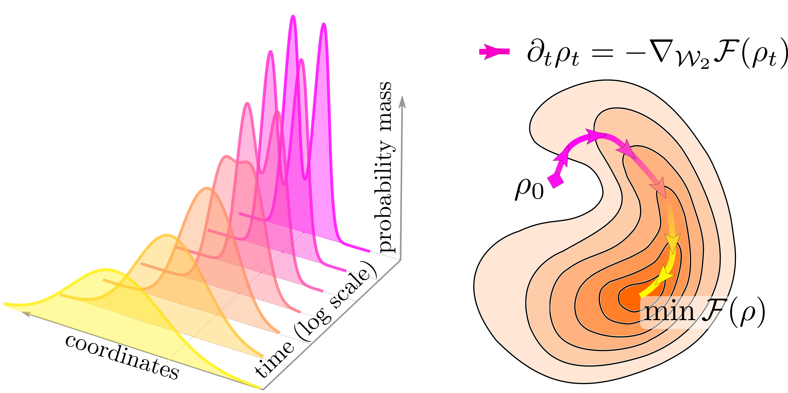

# Large-Scale Wasserstein Gradient Flows

This repository contains **code** and **results** of the experiments of NeurIPS 2021 paper *[Large-Scale Wasserstein Gradient Flows](https://arxiv.org/abs/2106.00736)* by [Petr Mokrov](https://www.semanticscholar.org/author/Petr-Mokrov/2106626550), [Alexander Korotin](https://scholar.google.ru/citations?user=1rIIvjAAAAAJ&hl=en), [Lingxiao Li](https://scholar.google.com/citations?user=rxQDLWcAAAAJ&hl=en), [Aude Genevay](https://scholar.google.com/citations?user=SryRaIMAAAAJ), [Justin Solomon](https://scholar.google.com/citations?user=pImSVwoAAAAJ) and [Evgeny Burnaev](https://scholar.google.ru/citations?user=pCRdcOwAAAAJ&hl=ru). We approximate gradient flows and, in particular, diffusion processes governed by Fokker-Planck equation using JKO scheme modelled via Input Convex Neural Networks. We conduct experiments to demonstrate that our approach works in different scenarios and machine learning applications.

<p align="center"></p>

## Citation

If you find this repository or the ideas presented in our paper useful, please consider citing our paper.

```
@misc{mokrov2021largescale,
      title={Large-Scale Wasserstein Gradient Flows}, 
      author={Petr Mokrov and Alexander Korotin and Lingxiao Li and Aude Genevay and Justin Solomon and Evgeny Burnaev},
      year={2021},
      eprint={2106.00736},
      archivePrefix={arXiv},
      primaryClass={cs.LG}
}
```

## Prerequisites

It is highly recommended to use GPU to launch our experiments. The list of required python libraries can be found in `./requirements.txt`. One can install the libraries via the following command:

```bash
> pip install -r requirements.txt
```

## Related repositories
- [Repository](https://github.com/iamalexkorotin/Wasserstein2GenerativeNetworks) for [Wasserstein-2 Generative Networks](https://openreview.net/pdf?id=bEoxzW_EXsa) paper.

## Experiments

All our experiments could be launched via `./script.py` script. The experiments use config files presented in `./configs/` directory which define hyperparameters of the experiments. See our submission for the details.

The results of the experiments are saved to the `./results` directory and could be visualized using `./W2JKO_results.ipynb` notebook. All the images representing our experiments are stored in `./images` directory

### Convergence to Stationary Solution

We test if our gradient flow approximating advection-diffusion process manage to converge to the stationary distribution.

#### Quantitative comparison

To reproduce the quantitative comparison of our method with particle based methods run the following:

```bash
> python .\script.py conv_comp_dim_[dimensionality] --method [method] --device [device]
```

Use *D = 2, 4, 6, 8, 10, 12* for `dimensionality` option, available methods are `ICNN_jko`, `EM_sim_1000`, `EM_sim_1000`, `EM_sim_50000`. Additionally one can consier `EM_ProxRec_400` and `EM_ProxRec_1000` methods. The `device` option make sense only for `ICNN_jko` method. 

In particular, the command below launches quantitative comparison experiment for the dimension *D=8* using our method on the `cuda:0` device:

```bash
> python .\script.py conv_comp_dim_8 --method ICNN_jko --device cuda:0
```

The results for all dimensions are presented in the image below:

<p align="center"></p>

#### Qualitative comparison

The qualitative comparion results could be reprodused via the following command:

```bash
> python .\script.py conv_mix_gauss_dim_[dimensionality] --device [device]
```

The `dimensionality` can be either *D = 13* or *D = 32*. The comparison between fitted and true stationary distribution for *D = 32* below:

<p align="center"></p>

### Modelling Ornstein-Uhlenbeck processes

We model advection-diffusion processes with special quadratic-form potentials which have close-form solution for marginal process distribution at each observation time.

To launch Ornstein-Uhlenbeck experiment run the command below:

```bash
> python .\script.py ou_vary_dim_freq --method [method] --device [device]
```
The available options for `method` are `ICNN_jko`, `EM_sim_1000`, `EM_sim_10000`, `EM_sim_50000`, `'EM_ProxRec_10000`, `dual_jko`. 

The obtained divergence between true and fitted distributions for *t = 0.9* sec.:

<p align="center"></p>

### Unnormalized Posterior Sampling

Given the prior distribution of model parameters and conditional data distribution we model posterior parameters distribution by establishing it as stationary one of the gradient flow.

The experiments with different benchmark datasets could be run as follows:

```bash
> python .\script.py [dataset]_data_posterior --device [device]
```
The supported datasets are : `covtype`, `diabetis`, `german`, `splice`, `banana`, `waveform`, `ringnorm`, `twonorm`, `image`.

### Nonlinear filtering

We model predictive distribution at final time-moment of the latent highly-nonlinear diffusion process *X* given noisy observations obtained at specific time moments.

To reproduce our results run the command:
```bash
> python .\script.py filtering --method [method] --device [device]
```
The available methods are: `ICNN_jko`, `dual_jko`, `bbf_100`, `bbf_1000`, `bbf_10000`, `bbf_50000`

The obtained discrepancy between fitted methods and ground truth method (Chang&Cooper numerical integration) presented below:

<p align="center"></p>

